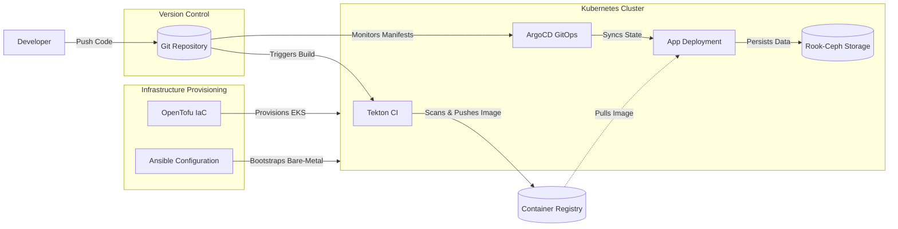

# 🚀 Cloud-Native DevOps & Infrastructure Blueprint

An enterprise-grade, **100% Open Source and Cloud-Agnostic** DevOps architecture blueprint. This repository serves as a fully automated, GitOps-driven deployment engine designed for zero-downtime scalability and maximum security. It completely avoids vendor lock-in by utilizing CNCF (Cloud Native Computing Foundation) graduated open-source standards.

## 🔄 The DevOps Cycle (How It Works)

Our DevOps cycle is designed to be entirely commit-driven, eliminating the need for manual server access or standalone CI/CD servers like Jenkins.

1. **Infrastructure Provisioning:** `OpenTofu` creates the cloud infrastructure (e.g., AWS VPC & EKS) via modular code.
2. **Commit & Build:** A developer pushes code to this repository.
3. **Serverless CI:** `Tekton` (running inside Kubernetes) detects the commit, spins up a temporary pod, builds the Go application via `Buildah`, and scans it with `Trivy`.
4. **GitOps Deployment:** Once the image is pushed to the registry, `ArgoCD` detects the new state in Git and automatically syncs the Kubernetes cluster with zero downtime.
5. **Storage & Persistence:** Stateful applications utilize `Rook-Ceph` for cloud-agnostic block and object storage.

## 🛠️ Technology Stack
* **Infrastructure as Code (IaC):** OpenTofu (100% open-source HCL engine)
* **Configuration Management:** Ansible (For bare-metal K3s bootstrap)
* **Container Orchestration:** Kubernetes (EKS / K3s)
* **CI/CD Pipeline:** Tekton (Serverless K8s-native builds) & ArgoCD (GitOps)
* **Storage:** Rook-Ceph (Cloud-agnostic block & object storage)
* **Security:** Trivy (Container & IaC vulnerability scanning)
* **Application Layer:** Go (Golang) microservice (Multi-stage, Distroless/Scratch secure Dockerfile)

## 📁 Repository Structure
* `/infrastructure` - OpenTofu modules for spinning up VPCs, EKS Clusters, and RDS databases.
* `/ansible` - Playbooks for bootstrapping K3s on raw Ubuntu/Debian nodes.
* `/ci-cd` - Tekton Tasks (Trivy, Buildah) and CI Pipelines.
* `/gitops` - ArgoCD Application definitions.
* `/kubernetes` - Kustomize/Helm manifests for the application and system components.
* `/app` - The Go microservice source code.

## 🧩 Enterprise Extensions (Optional Modules)
This blueprint is designed like a Lego set. It includes a modular `/kubernetes/extensions` directory containing pre-configured, industry-standard tools that can be enabled on-demand depending on the client's needs, without bloating the core architecture:

| Category | Component | Description |
| :--- | :--- | :--- |
| **Networking & Mesh** | `cilium-mesh` | eBPF-based high performance Service Mesh & CNI. |
| **Traffic & SSL** | `ingress-nginx` & `cert-manager` | Automated Let's Encrypt TLS and edge routing. |
| **Identity & IAM** | `keycloak` | Open-Source Identity and Access Management (SSO). |
| **Secrets Management**| `hashicorp-vault` | Secure storage for API keys and database passwords. |
| **API Gateway** | `kong-gateway` | Rate-limiting, WAF, and microservices routing. |
| **Observability** | `prometheus` + `loki` | Full-stack metrics and lightweight centralized logging. |

## 🚀 Bootstrap Guide
*Clone the repository and follow the instructions in the respective layer folders to spin up the entire stack.*
